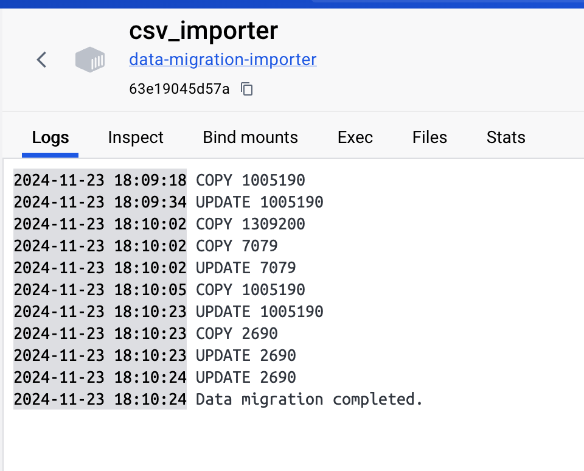
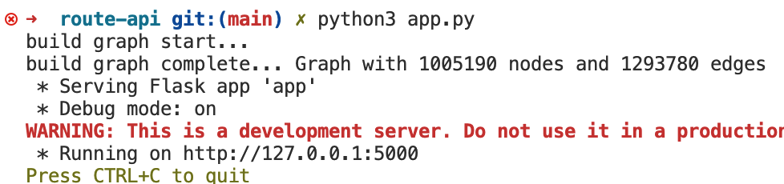

# Running Routes for Out-of-Towners

Running Routes for Out-of-Towners is a web-based application designed to help runners visiting a new city find the perfect route based on their preferences for **distance**, **elevation**, and **points of interest (POIs)**. Whether you’re looking to challenge yourself with elevation changes or simply enjoy scenic landmarks while staying active, this tool creates a route tailored just for you.

## Project Report

The project report is available here:

[Download the report](./report/final_report.pdf)

## Features

- **Custom Route Planning**: Generates running routes based on user-defined distance and preferences.

- **Elevation and POI Preferences**:
  - Elevation range selection.
  - Minimum POI requirement.
  - Priority factor selection (elevation vs POIs).

- **Google Places Integration**: 
  - Autocomplete for start and end locations.
  - Retrieve coordinates for selected locations.

---

## Technologies Used

### Backend:
- **Python**: Core backend language.
- **Flask**: Backend web framework.
- **SQLAlchemy**: Database ORM for querying nodes and edges.
- **PostgreSQL with PostGIS**: Spatial database for geospatial data.
- **NetworkX**: Graph library for pathfinding and graph operations.

### Frontend:
- **React**: Frontend framework.
- **Material-UI**: Stylish and responsive UI components.
- **Leaflet**: Map integration for route visualization.

---


## Project Construction Details

### Data Preparation
1. **OSM Data**: 
   - The project uses OpenStreetMap (OSM) data for British Columbia, downloaded from the [Geofabrik website](https://download.geofabrik.de/north-america/canada/british-columbia.html).

2. **Construct Nodes and Edges**:
   - The raw OSM data was processed using [osm4routing](https://github.com/Tristramg/osm4routing), producing **nodes** and **edges** CSV files required for routing.

3. **Merge Elevation and POI Data**:
   - The `elevation.py` and `poi.py` scripts in the `data-migration` directory were used to merge elevation and POI data into the nodes data, which was then stored in a PostgreSQL database.

### Graph Creation and Routing
- After preparing the database, a graph was created using the `NetworkX` library in the `create_graph.py` script.
- The **BiDirectionalAStar** algorithm was implemented to find optimized routes based on user preferences for distance, elevation, and POIs.

### Backend and Frontend Data Flow
1. The backend (`app.py`) handles user preferences and processes the data:
   - Resolves starting and ending locations using Google Places API.
   - Identifies the closest nodes to these locations.
   - Uses the BiDirectionalAStar algorithm to calculate the valid routes.
2. The frontend (`App.js`) retrieves the route data from the backend and visualizes it on an interactive map.

## Project Structure

### Backend (`route-api/`):
- **`app.py`**: Flask application, routes, and Google API proxies.
- **`BiDirectionalAStar.py`**: Implementation of Bi-Directional A* algorithm to generate routes that meet the distance constraint.
- **`controller/`**: Database query functions for nodes and edges.
- **`database/db.py`**: SQLAlchemy database instance.
- **`model/models.py`**: SQLAlchemy models for nodes and edges.
- **`create_graph.py`**: Graph creation and caching logic using NetworkX.

### Frontend (`route-frontend/`):
- **`src/App.js`**: Main React application with interactive map and user inputs.
- **`src/components/`**: Components for user interaction and result visualization.

---

## Installation

### Prerequisites
- **Python 3.8+**
- **Node.js** and **npm**
- **Docker** (for database setup)
- **Git Large File Storage**: [Git LFS Documentation](https://git-lfs.github.com/)


### Important Notes
- **If Git LFS is not installed**, the download of  `csv_data/edges.csv` under `data-migration` may fail. Please ensure that Git LFS is properly installed and configured to handle large files in the repository.
- Ensure that the file `csv_data/edges.csv` under `data-migration` contains the required data. If it does not contain the complete data (1,309,201 rows), you will need to download it manually from the repository and place it under the `csv_data` directory.
## Steps to Run the Project

#### 1. Data Migration

1. Navigate to the `data-migration` directory.
   ```bash
   cd data-migration
   ```
 
2. Execute the following command to set up the database using Docker:
   ```bash
   docker compose up -d
   ```

   This command sets up a PostgreSQL database with PostGIS support and populates it with the processed OSM, elevation, and POI data.

3. Wait for a few minutes and then check the Docker dashboard. Ensure that the `csv-importer` container has completed its process. You should see the following log upon successful completion.
- **Note**: You cannot start the backend unless this process is complete, as the data is required for the backend to function properly.
   

#### 2. Start the Backend

1. Navigate to the `route-api` directory.
   ```bash
   cd route-api
   ```

2. Install the required Python dependencies:
   ```bash
    pip3 install -r requirements.txt
   ```

3. Start the Flask backend server:
   ```bash
    python3 app.py
   ```

##### Backend Initialization
When you first start the backend, the initialization process can take a significant amount of time. **Please be patient.**

Once the process completes successfully, you will see logs indicating the progress and confirming the completion of all tasks. Kindly wait until these logs appear.

If the graph is created successfully, you should see the following log:
```
build graph complete... Graph with 1,005,190 nodes and 1,293,780 edges
```



#### 3. Start the Frontend

1. Navigate to the `route-fronend` directory.
   ```bash
   cd route-fronend
   ```

2. Install npm dependencies:
   ```bash
   npm install
   ```

3. Start the React development server:
   ```bash
   npm start
   ```

#### 3. Access the Application

1. Open a browser and navigate to:
   ```bash
    http://localhost:3000
   ```

2. Input preferences and explore the generated routes.

## Usage

### Select Start and End Locations
- Input locations using the search boxes. Suggestions are powered by Google Places API.

- Select a location from the dropdown list.

### Set Preferences

- Enter the desired running distance (in kilometers).

- Specify an elevation range and a minimum number of POIs.

- Choose to prioritize elevation or POIs.

### Generate Route

- Click `Get Route` to calculate the optimal path.

- View route details such as total distance, elevation change and number of POIs along the path.

### Visualize Route

- View the calculated route on the map, including markers for POIs and route segments.

## Authors

- Mon-shan Lin: 
- Shirui Chen: 
- Tao Wu: 
- Wenjing Yang:  

